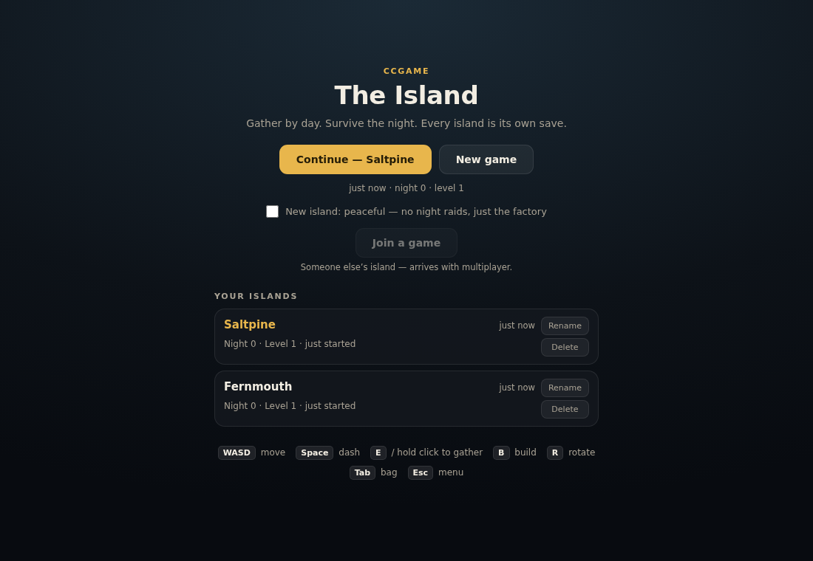

# CCgame — The Island

A cozy, persistent island survival game that runs in the browser.

Automate an island. Gather by hand, then stop doing it by hand.


## What it is

You wash up on a procedurally generated island. You gather by hand at first,
then you automate it: miners on ore patches, belts carrying ore to furnaces,
furnaces feeding assemblers. The factory grows, and throughput becomes the
puzzle — not "do I have enough iron" but "can I make enough iron per minute".

At night, easy creatures wander in from the dark while your weapons fire
themselves and you reposition and dash. Or start a **peaceful** world, where the
factory is the whole game. Either way the island keeps everything you build.

Designed so it is fully enjoyable alone, with drop-in multiplayer layered on
later. See [DESIGN.md](DESIGN.md) for the full design.

## Playing

The game opens on a main menu. **New game** starts a fresh island, and every
island is its own save — start as many as you like, name them what you like,
and pick up any of them from the menu. `Esc` (or the ☰ button) pauses and takes
you back there; the island is saved on the way out.



| Action | Key |
| --- | --- |
| Move | `WASD` / arrow keys |
| Dash | `Space` |
| Gather | `E`, or hold the mouse button |
| Build mode | `B` |
| Rotate the piece you are placing | `R` |
| Remove what is under the cursor | `X` or right-click |
| Inspect a machine | Click it outside build mode |
| Bag | `Tab` |
| Close panel, or open the menu | `Esc` |

On touch devices: drag the left half of the screen to move, tap the right half
to gather, and use the on-screen buttons.

## Running it

```bash
npm install
npm run dev        # dev server with hot reload
```

Other scripts:

```bash
npm run build      # typecheck + production bundle into dist/
npm run preview    # serve the production build
npm test           # simulation test suite
npm run typecheck  # types only
```

The production bundle is ~47 KB (17 KB gzipped) with no runtime dependencies,
and the whole thing is a static site — it can be hosted anywhere.

## How the code is laid out

```
shared/            Deterministic simulation — no DOM, no rendering
  data/            Tuning tables: items, mobs, weapons, buildings, upgrades
  sim/             World state, terrain generation, and the tick
    systems/       One file per system: movement, gathering, combat, mobs, …
    __tests__/     Simulation tests
src/               Browser client
  render/          Canvas renderer: terrain mesh, entities, lighting, effects
  ui/              DOM overlay: main menu, HUD, modals, build bar
```

The important boundary is `shared/` ⇄ `src/`. Everything in `shared/` is a pure
function of state plus inputs — it never touches `Math.random`, the DOM, or
wall-clock time. That is what makes the simulation unit-testable today, and what
will let an authoritative server run the exact same code once multiplayer
arrives, with the client predicting locally against it.

`step(world, inputs, dt)` is the whole simulation. Same world plus same inputs
always produces the same result.

## The factory

Place a **miner** on an ore patch, run a **belt** from it to a **furnace**, and
point the furnace at a **chest**. That is the whole idea; everything later is
the same idea with more steps.

Adding depth means adding rows to `shared/data/recipes.ts` — machines are driven
generically by that table, so new content needs no new systems.

## Status

**Phases 1–3 are done.** Solo play, persistence, and the first three factory
tiers: ore, miners, belts, furnaces, assemblers, chests, and a per-world
peaceful mode. Saves are per island: one localStorage entry each, plus a small
index the menu reads. An island saved before the menu existed is adopted as
your first slot, untouched.

Next: power and deeper chains, then the multiplayer server and hostable worlds.

## Documentation

| File | What it holds |
| --- | --- |
| [DESIGN.md](DESIGN.md) | What the game is: pillars, loop, systems, architecture |
| [ROADMAP.md](ROADMAP.md) | Phase status, tier ladder, decision log, open questions |
| [CLAUDE.md](CLAUDE.md) | How to work on it: conventions, invariants, verification |
